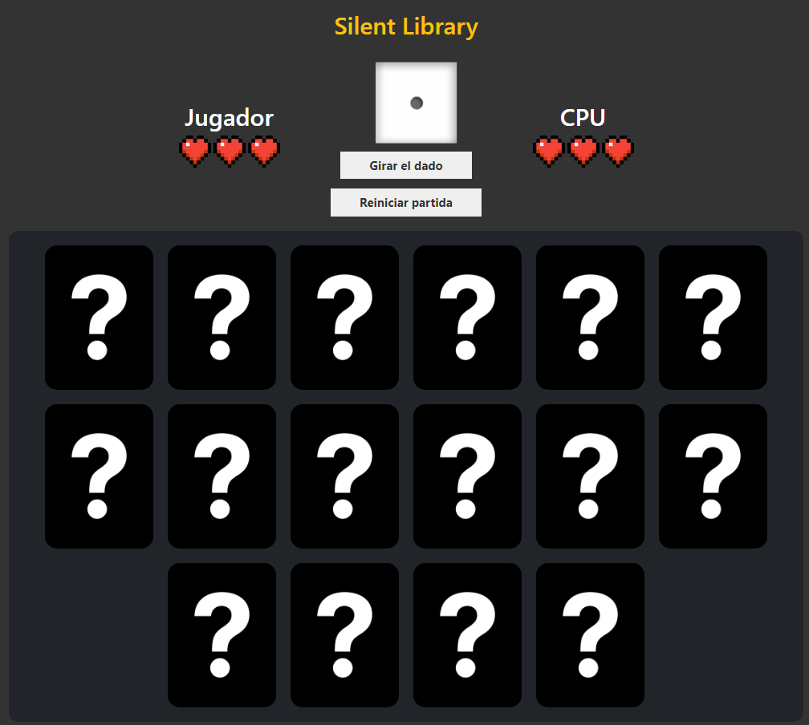

# Silent Library
Proyecto recuperado de mi Formación Profesional

Videojuego inspirado en el antiguo programa de tv llamado 'Silent Library' 📖, en el cuál no podías hacer ruido y tenías que cumplir una serie de retos si te tocaba la carta de castigo, la calavera.

## Cómo jugar
La dinámica del juego es sencilla, 3 vidas tú y 3 vidas la máquina. Quien aguante con vida, gana. 

Es un juego por turnos, destapas una carta y la máquina destapa otra. Si destapas una carta blanca (SAFE), consigues 100 puntos. Si por el contrario destapas una carta de castigo (☠️), pierdes una vida.
Tienes una pequeña ayuda, el dado 🎲. Este estará disponible al comienzo de tus turnos. Si lo giras y sale un 6, tu turno se saltará y le tocará directamente a la máquina. Este dado es un arma de doble filo, si quieres conseguir el máximo de puntos, puede que girar el dado no sea la mejor opción en todos los turnos.

Y eso sería todo, a disfrutar con las animaciones de destapamiento y giradas de dado.

*Fecha estimada de creación del proyecto: 02/23*
